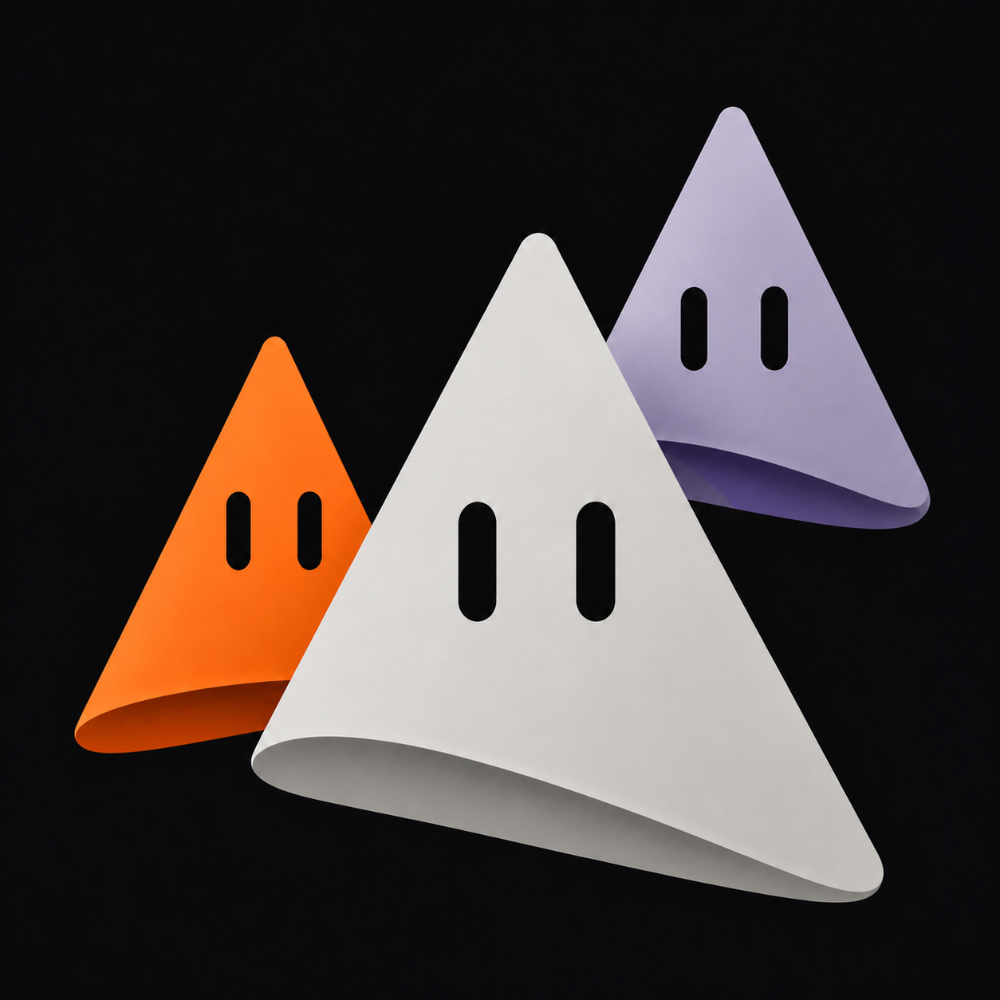

<p align="center">
  
</p>

# Cumea

> A council of agents. One clear voice.

Cumea is an open-source, self-hosted workspace where each conversation is a real AI agent. The
desktop or user-owned VM is the host: it runs providers, tools, routines, and durable task history.
The Expo mobile companion is an authenticated control surface for that host and opens on the agent
list—not inside a chat.

> **Project status:** early development. Build from source; no signed/notarized desktop release or
> store-distributed mobile build is published yet. macOS is the primary desktop target. CI exercises
> the portable harness on macOS, Linux, and Windows, but that is not physical-device validation of
> native behavior on every platform.

[](https://github.com/metaforismo/Cumea/actions/workflows/ci.yml)
[](LICENSE)

## Why Cumea

Most assistants are a single chat attached to a single model. Cumea treats agents as a small,
visible team:

- one thread and persona per agent;
- Claude Code, Codex, Grok, and Gemini CLI adapters behind one driver contract;
- agent-to-agent delegation with recursion limits;
- explicit per-action approval cards, with remembered Ask / Always / Never policies per bot;
- optional local or cloud computer use;
- optional connected-app tools through Composio;
- sections, sidebar search, an owner-local bounded transcript search index, file attachments,
  reusable routines, and a “Needs you” inbox;
- persistent Mote-based bot avatars with shape, palette, upload, semantic activity states, and
  reduced-motion behavior;
- an agent-first Expo companion for pairing, search, chat, stop, approvals, and routine status;
- durable tasks, runs, tool steps, handoffs, artifacts, transcripts, configuration, and event logs.

The product name comes from the Sibyl of Cumae: one interface that gives a clear voice to a council
of agents.

## Desktop host and mobile companion

| Surface | Current responsibility |
|---|---|
| Desktop or user-owned VM | Provider authentication, agent configuration, computer/app access, attachments, task/run history, routine creation and scheduling, pairing, and device revocation |
| Mobile companion | Onboarding and secure pairing, agent-list home, search, per-agent chat, text/file send and stop, bot creation, “Needs you” responses, routine status, Mote avatar state, and optional read-only computer preview |

Mobile does not run providers on the phone and Cumea does not supply a managed VM. For work to
continue after a laptop is closed, the user must keep the same Cumea harness running on an
authenticated machine they control. The mobile client consumes a narrowed authenticated SSE stream,
reconciles a fresh bootstrap snapshot after each connection, pauses in the background, and reconnects
unexpected closures with bounded backoff.

The desktop uses a separate local-only bootstrap contract: one bounded snapshot carries the agent
index, selected transcript page, engine/configuration status, workspace projection, Needs You count,
and a monotonic event cursor. SSE is opened first and buffered during the snapshot cut, so reconnects
can discard already-represented events instead of re-running four independent startup fetches. See
[desktop bootstrap consistency](docs/desktop-bootstrap.md).

Push/background notifications, paired-host routine editing,
voice dictation, and signed physical-device acceptance are not complete. Demo mode is explicitly
local sample data and is not evidence that a provider task ran.

## Privacy and security defaults

- Cumea ships with **no analytics or telemetry SDK**.
- App data is stored under `~/.cumea/`; there is no migration from or shared state with OpenMausBot.
- Attachments are owner-local files under `~/.cumea/attachments/`; no Cumea-operated upload service
  exists. When a bot uses a third-party model or app, that provider may still receive the file path
  or file contents as part of the requested work. Uploads are bounded to 25 MiB each and to a
  persistent quota of 100 files / 250 MiB per bot.
- Files already referenced by the task audit trail are retained and cannot yet be reclaimed from
  the UI. Long-lived attachment-heavy agents may therefore reach that quota; the current recovery
  path is deleting the agent after reviewing the impact; that operation removes the agent's files
  and audit data together. Audit-aware storage management is tracked on the roadmap.
- The desktop harness binds to `127.0.0.1` and rejects state-changing browser requests from foreign
  origins. Remote access is a separate listener, disabled by default.
- Optional mobile access uses a short-lived, single-use 256-bit pairing secret. Device bearer tokens
  are returned once, stored in SecureStore on mobile, stored only as SHA-256 hashes on the host, and
  can be revoked from the trusted local UI.
- The remote transcript, workspace, and SSE surfaces use explicit allowlists: hidden bots, provider
  errors, prompts, reasoning, raw screen frames, configuration, and credential-shaped fields stay
  local.
- A remotely reachable host requires HTTPS terminated by the user's reverse proxy, secure tunnel,
  or private-network gateway. The raw Node HTTP listener must not be exposed to the public internet.
- Remote computer preview is off by default. If explicitly enabled, it exposes only the latest
  already-captured PNG/JPEG frame, never computer control, and still requires a paired device token.
- Packaged optional credentials are encrypted through the operating-system credential service,
  remain write-only to the renderer, and are supplied only to a fresh local harness bootstrap.
  Credential-shaped writes to the ordinary packaged config API are rejected, and each provider
  receives only the credential it owns. Source/browser hosting retains an explicit owner-only
  `config.json` fallback.
- External links are limited to HTTPS, with HTTP allowed only for loopback development URLs.
- Agents do not receive blanket approval by default. Provider modes that bypass consent remain an
  explicit user choice.

Third-party services are contacted only when you configure or invoke them. Their own terms, data
handling, subscriptions, and usage charges still apply.

See [SECURITY.md](SECURITY.md) for the reporting policy and threat boundaries.

## Optional credentials

No third-party credential is required to open Cumea or use an already-authenticated local agent CLI.
The Settings help icon explains where each optional secret is obtained, when it leaves the machine,
and where charges may apply.

| Credential | What it enables | Sent to |
|---|---|---|
| [xAI API key](https://console.x.ai/) | Optional key-billed Grok API driver; Grok Build CLI authentication is separate | `api.x.ai`, only for turns explicitly routed through that API driver |
| [Composio Connect API key](https://docs.composio.dev/docs/composio-connect) | App discovery, OAuth connection, and app actions | `connect.composio.dev`, only when connected apps are used |
| [Composio project API key](https://docs.composio.dev/reference/authenticating-to-composio) | Full connected-app catalog; optional and preferably scoped | `backend.composio.dev`, only while loading that catalog |
| [Cloud computer token](https://box.ascii.dev) | Remote desktop provisioning and control | `box.ascii.dev`, only for cloud-computer actions |

The packaged Electron desktop encrypts these values through Electron `safeStorage`, migrates legacy
plaintext only after a decryptable encrypted replacement exists, and refuses new plaintext writes
when the OS credential service is unavailable. Its OS vault is authoritative: ambient or advanced
instance credential aliases cannot silently replace it, and unrelated Claude, Codex, Gemini, or
Grok Build CLI processes do not inherit these values. Source/browser hosting has no Electron main
process, so it retains the explicit `~/.cumea/config.json` owner-only fallback. Cumea does not proxy
credentials through a Cumea-operated service. See
[desktop credential storage](docs/credential-storage.md) for migration, recovery, restart, platform,
and threat-boundary details.

## Run from source

Requirements:

- Node.js 24+
- pnpm 10.33+
- at least one supported agent CLI installed and authenticated to run real turns
- macOS for the current Electron computer-use and dictation integration

The Node harness and UI are portable. `package:linux` and `package:win` produce unsigned preview
artifacts, but they have not been exercised on physical Linux/Windows machines in this tranche.
Local computer control and on-device dictation remain explicitly macOS-only; cloud computers,
chat, tasks, routines, sections, attachments, and supported provider CLIs degrade independently.

```sh
git clone https://github.com/metaforismo/Cumea.git
cd Cumea
pnpm install
```

Start the harness and UI in separate terminals:

```sh
pnpm dev:server
pnpm dev
```

For the Electron shell:

```sh
pnpm dev:desktop
```

Unsigned packaging commands:

```sh
pnpm package:mac
pnpm package:linux
pnpm package:win
```

Run the Linux command on Linux and the Windows command on Windows for release validation. A package
created elsewhere is not evidence that native behavior works on that OS.

The browser UI runs on `http://127.0.0.1:5199`; the local harness uses
`http://127.0.0.1:8799`.

### Mobile companion

The Expo app lives in `apps/mobile`. After installing workspace dependencies:

```sh
pnpm --filter @cumea/mobile start
pnpm --filter @cumea/mobile typecheck
pnpm --filter @cumea/mobile export
```

The app can be reviewed with demo data, but real enrollment needs the optional authenticated host
listener described in [docs/self-hosted-mobile.md](docs/self-hosted-mobile.md). A development build
is required for release-faithful camera, permission, SecureStore, and distribution testing; a JS
export alone does not establish physical-device support. Pairing credentials are accepted only by
the in-app QR scanner, explicit paste, or manual fields—not from operating-system launch URLs.

## Current provider capability matrix

The model picker is multi-provider, but tool mounting follows each CLI's verified protocol instead
of pretending every provider can do everything. Settings show unsupported switches as unavailable.

| Runtime | Chat | Bot handoff | Connected apps | Local computer | Cloud computer |
|---|---:|---:|---:|---:|---:|
| Claude Agent | yes | yes | yes | macOS | yes |
| Grok / Gemini ACP | yes | yes | not yet | macOS | not yet |
| Codex app-server | yes | not yet | not yet | not yet | not yet |
| Box cloud agent | yes | not yet | not yet | no | yes |

“Teach as routine” currently captures a completed bot task and its prompt; it does not yet record a
human clicking through an arbitrary desktop workflow. Scheduled routines run while the Cumea
harness is running. Laptop-off execution therefore works only when that harness and its configured
provider runtime remain online on the user's own authenticated host.

## Verify a change

```sh
pnpm typecheck
pnpm test
pnpm build
pnpm build:server
pnpm --filter @cumea/mobile typecheck
pnpm --filter @cumea/mobile export
pnpm release:sbom
```

The CI matrix runs root type checking and tests on macOS, Ubuntu, and Windows; production UI and
harness builds plus an SBOM on Ubuntu; Expo JavaScript and independently locked landing builds on
Ubuntu; and an unsigned macOS arm64 package-layout smoke. A green CI run is not evidence of signing,
notarization, native desktop behavior on every OS, or physical-device mobile support. See
[the release checklist](docs/releasing.md) for the evidence required before publishing a Developer
Preview.

## Architecture

| Path | Responsibility |
|---|---|
| `src/` | React desktop UI and client-side state folding |
| `server/index.ts` | loopback HTTP/SSE harness and turn orchestration |
| `server/pairing.ts` | expiring one-time pairing sessions, hashed device tokens, and revocation |
| `server/mobile.ts` | allowlisted mobile bot/message projections and sanitized remote SSE events |
| `server/workspace.ts` | durable sections, attachments, tasks, runs, artifacts, and schedules |
| `server/message-search-index.ts` | owner-local derived SQLite/WAL transcript search projection |
| `server/transcript-store.ts` | P0.11b canonical SQLite/WAL transcript database foundation, verified legacy import, revisions, deletion staging, and local backup primitive |
| `server/contracts.ts` | provider driver and canonical event contracts |
| `server/drivers/` | Claude, Codex, Grok, Gemini, computer, and peer-agent adapters |
| `server/harness/` | provider registry and event bus |
| `electron/` | desktop shell, OS-backed credential vault, native permissions, dictation, and local computer use |
| `apps/mobile/` | Expo Router companion, agent-list home, pairing, chat, approvals, and routines |

The renderer owns no provider transport. Commands cross the local API, providers emit one canonical
event stream, and the UI folds that stream into visible conversation state. Local transcript search
uses a separate derived SQLite/WAL projection over user-visible message fields only. P0.11b1 now
provides the versioned `transcripts.sqlite` canonical-store contract and verified legacy import, but
production `Store` reads/writes still remain on the rollback-safe JSON path until P0.11b2 switches
them. See [local transcript search](docs/transcript-search.md) and
[canonical transcript persistence](docs/transcript-persistence.md).

Packaged desktop startup keeps the renderer on the stable private origin `http://127.0.0.1:8799`.
Electron serves the built UI from its own loopback gateway, starts the API-only harness on an
OS-assigned private loopback port, and attaches that port only after a versioned UtilityProcess
readiness message matches the exact child PID. The packaged harness therefore does not expose a
second renderer origin or rely on fixed private fallback ports. Source development still uses the
fixed `:5199` UI and `:8799` harness pair described above.

## Direction

The immediate engineering priorities are steady-state renderer/thread scaling, incremental local
transcript persistence and search, agent liveness/loop protection, signed consumer distribution,
mobile completion gates, and wider provider/computer capability parity. These changes keep Cumea's
no-account local-first security model and its Grok-like three-pane desktop / agent-list-first mobile
identity instead of replacing them with a hosted control plane.

See [ROADMAP.md](ROADMAP.md) for the ordered backlog,
[the 2026-08-18 Rakazo/OpenMaus engineering audit](docs/competitive-audit-2026-08-18.md) for the latest
`adopt / adapt / reject` decisions, and [docs/UPSTREAM.md](docs/UPSTREAM.md) for the earlier upstream
issue/PR audit.

## Contributing

Read [CONTRIBUTING.md](CONTRIBUTING.md) before opening an issue or pull request. Small, testable
changes are preferred; security-sensitive changes need an explicit threat-boundary explanation.

Scheduled Dependabot version-update PRs are disabled. GitHub vulnerability alerts and automatic
security fixes remain enabled as the safer default; maintainers still review every proposed update
and may replace it with a pinned, manually tested tranche. Disabling security-fix PRs is a separate
repository-security decision.

## Provenance

Cumea began from the MIT-licensed
[OpenMausBot](https://github.com/milind-soni/OpenMausBot) codebase at commit `dea4de8`. It is an
independent project: it does not share application data, release artifacts, telemetry, or governance
with OpenMausBot. The original Git history and copyright notice are retained.

Bot avatar geometry and palette adapt the MIT-licensed
[Mote Studio](https://github.com/metaforismo/mote-studio). The mobile conversation examples in
[margelo/ai-chat-demo](https://github.com/margelo/ai-chat-demo) were studied only as interaction
references: no source code or assets from that repository are included because it had no explicit
software license when reviewed. Complete dependency notices are in
[THIRD_PARTY_NOTICES.md](THIRD_PARTY_NOTICES.md).

## License

[MIT](LICENSE). Copyright remains with the original OpenMausBot authors for their work; subsequent
Cumea contributions remain with their respective contributors under the same license.
