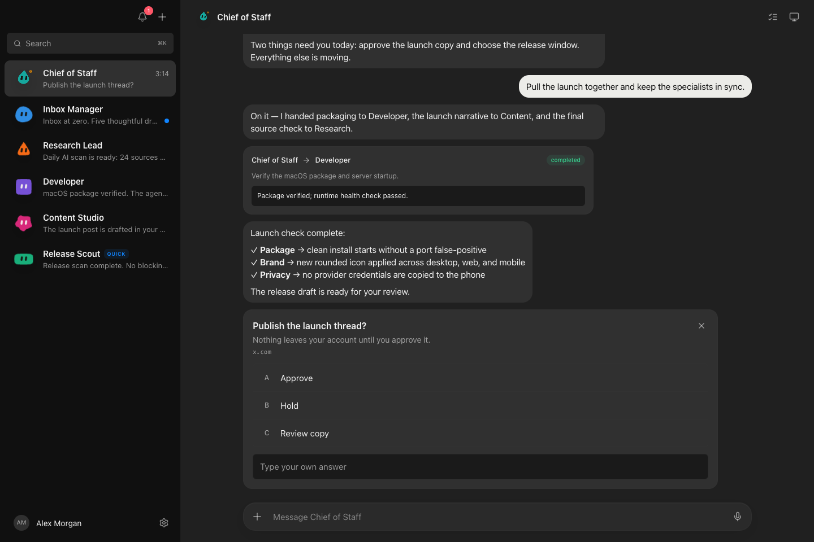
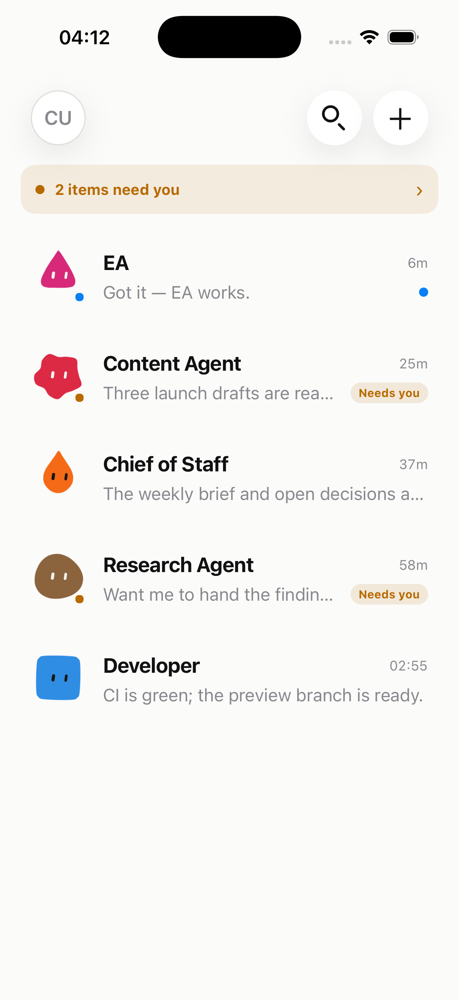
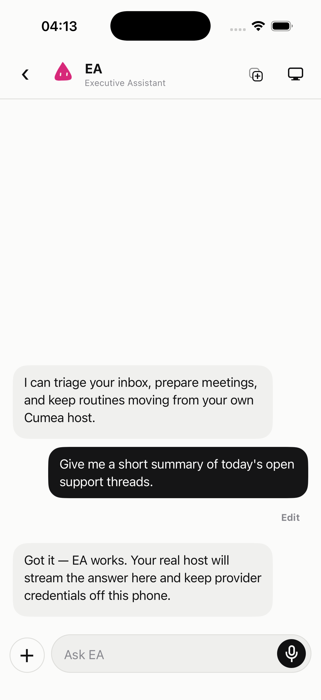

<p align="center">
  
</p>

# Cumea

> A council of agents. One clear voice.

Cumea is an open-source, self-hosted workspace where each conversation is a real AI agent. The
desktop or user-owned VM is the host: it runs providers, tools, routines, and durable task history.
The Expo mobile companion is an authenticated control surface for that host and opens on the agent
list—not inside a chat.

> **Project status:** early development. Build from source; no signed/notarized desktop release or
> store-distributed mobile build is published yet. macOS is the primary desktop target. CI exercises
> the portable harness on macOS, Linux, and Windows, but that is not physical-device validation of
> native behavior on every platform.

[](https://github.com/metaforismo/Cumea/actions/workflows/ci.yml)
[](LICENSE)

## Why Cumea

Most assistants are a single chat attached to a single model. Cumea treats agents as a small,
visible team:

- one thread and persona per agent;
- editable user messages with non-destructive conversation branches and accessible version
  switching on desktop and mobile;
- a durable FIFO queue per agent, so another handoff can be added while a long task is running,
  plus explicit “Fresh context” boundaries that keep the named agent while starting a clean
  provider session;
- Claude Code, Codex, Grok, and Gemini CLI adapters behind one driver contract;
- agent-to-agent delegation with recursion limits;
- explicit per-action approval cards, with revocable remembered rules scoped to one tool and,
  for command tools, one normalized program;
- optional local or cloud computer use;
- optional connected-app tools through Composio;
- sections, real sidebar search, picker/drop/paste file attachments, clickable agent output paths
  with safe Markdown, PDF, DOCX, and static isolated HTML previews, reusable routines, and a
  “Needs you” inbox;
- permanent agents plus 24-hour Quick bots that expire only after work, routines, and live approval
  requests are safely settled, with an explicit “Keep permanently” action;
- persistent Mote-based bot avatars with shape, palette, upload, semantic activity states, and
  reduced-motion behavior;
- an agent-first Expo companion for pairing, search, queued chat, clean task contexts, stop,
  approvals, and routine status, with native system light/dark appearance;
- durable tasks, runs, tool steps, handoffs, artifacts, transcripts, configuration, and event logs;
- explicit acceptance-evidence requirements whose claimed, observed, and independently verified states
  remain separate from ordinary task completion;
- durable fail-safe receipts for controlled external effects, with unknown outcomes blocked from
  automatic replay and resolved only from the local desktop.

The product name comes from the Sibyl of Cumae: one interface that gives a clear voice to a council
of agents.

## Product screenshots

Every image below was captured from Cumea itself with synthetic demo data; no Grok Bot, OpenMausBot,
Rakazo, provider, or customer screenshot is embedded in the repository.

<p align="center">
  
</p>

<p align="center">
  
  
</p>

## Desktop host and mobile companion

| Surface | Current responsibility |
|---|---|
| Desktop or user-owned VM | Provider authentication, agent configuration, computer/app access, attachments, task/run history, routine creation and scheduling, pairing, and device revocation |
| Mobile companion | Onboarding and secure pairing, agent-list home, search, per-agent queued chat and branch editing, clean task contexts, text/file send and stop, permanent/Quick bot creation, “Needs you” responses, bounded routine editing/status, Mote avatar state, and optional read-only computer preview |

Mobile does not run providers on the phone and Cumea does not supply a managed VM. For work to
continue after a laptop is closed, the user must keep the same Cumea harness running on an
authenticated machine they control. The mobile client consumes a narrowed authenticated SSE stream,
reconciles a fresh bootstrap snapshot after each connection, pauses in the background, and reconnects
unexpected closures with bounded backoff.

Push/background notification acceptance and signed mobile distribution are not complete.
Mobile dictation is implemented through the native iOS/Android speech service,
but its microphone and permission flow has not yet been accepted on physical devices. Demo mode is
explicitly local sample data and is not evidence that a provider task ran.

## Privacy and security defaults

- Cumea ships with **no analytics or telemetry SDK**.
- Desktop dictation uses Apple's Speech framework. Cumea requires on-device recognition when the
  Mac reports it as available; otherwise Apple Speech Recognition may process microphone audio
  over the network. Cumea does not persist a dictation recording.
- App data is stored under `~/.cumea/`; there is no migration from or shared state with OpenMausBot.
- Attachments are owner-local files under `~/.cumea/attachments/`; no Cumea-operated upload service
  exists. When a bot uses a third-party model or app, that provider may still receive the file path
  or file contents as part of the requested work. Uploads are bounded to 25 MiB each and to a
  persistent quota of 100 files / 250 MiB per bot.
- Local agent deliverables live in an explicit per-bot workspace. A path printed in chat is never
  opened directly: the host checks workspace containment, file type and size, then returns a
  short-lived opaque capability. Cloud-computer deliverables use the same model under `/workspace`.
  See [the file-preview threat model](docs/file-preview-security.md).
- Files already referenced by the task audit trail are retained and cannot yet be reclaimed from
  the UI. Long-lived attachment-heavy agents may therefore reach that quota; the current recovery
  path is deleting the agent after reviewing the impact; that operation removes the agent's files
  and audit data together. Audit-aware storage management is tracked on the roadmap.
- The desktop harness binds to `127.0.0.1` and rejects state-changing browser requests from foreign
  origins. Remote access is a separate listener, disabled by default.
- Optional mobile access uses a short-lived, single-use 256-bit pairing secret. Device bearer tokens
  are returned once, stored in SecureStore on mobile, stored only as SHA-256 hashes on the host, and
  can be revoked from the trusted local UI.
- The remote transcript, workspace, and SSE surfaces use explicit allowlists: hidden bots, provider
  errors, prompts, reasoning, raw screen frames, configuration, and credential-shaped fields stay
  local.
- Active runs interrupted by a restart are never silently completed or resumed. Explicit desktop
  recovery uses bounded provider-neutral checkpoints and blocks while an external effect is unknown.
  See [resumable run checkpoints](docs/resumable-checkpoints.md).
- A remotely reachable host requires HTTPS terminated by the user's reverse proxy, secure tunnel,
  or private-network gateway. The raw Node HTTP listener must not be exposed to the public internet.
- Remote computer preview is off by default. If explicitly enabled, it exposes only the latest
  already-captured PNG/JPEG frame, never computer control, and still requires a paired device token.
- Configuration secrets are never returned by the API and `config.json` is written with owner-only
  permissions where the platform supports them.
- External links are limited to HTTPS, with HTTP allowed only for loopback development URLs.
- Agents do not receive blanket approval by default. Provider modes that bypass consent remain an
  explicit user choice.
- Questions always wait for a person. Durable allow rules never cover destructive or secret access,
  privilege escalation, command interpreters, transfer utilities, or unparseable/encoded commands;
  a paired phone can answer the current request but cannot create or revoke a durable rule.

Third-party services are contacted only when you configure or invoke them. Their own terms, data
handling, subscriptions, and usage charges still apply.

The desktop **Settings → Privacy & data** view derives a safe, live inventory from the host's
current provider, connector, MCP, Local VM, push, and pairing state. It shows the categories of data
that may cross each boundary and the applicable trigger/consent mode without exposing tokens,
endpoints, paths, prompts, filenames, provider-instance labels, or device identities. “Available”
means local prerequisites are detected; it does not claim a third-party account or network is
healthy. Separately installed CLIs and MCP processes may forward or retain data in ways Cumea cannot
observe, so their own documentation and configuration remain authoritative.

See [SECURITY.md](SECURITY.md) for the reporting policy and threat boundaries.

## Optional credentials

No third-party credential is required to open Cumea or use an already-authenticated local agent CLI.
The Settings help icon explains where each optional secret is obtained, when it leaves the machine,
and where charges may apply.

| Credential | What it enables | Sent to |
|---|---|---|
| [Composio Connect API key](https://docs.composio.dev/docs/composio-connect) | App discovery, OAuth connection, and app actions | `connect.composio.dev`, only when connected apps are used |
| [Composio project API key](https://docs.composio.dev/reference/authenticating-to-composio) | Full connected-app catalog; optional and preferably scoped | `backend.composio.dev`, only while loading that catalog |
| [Cloud computer token](https://box.ascii.dev) | Remote desktop provisioning and control | `box.ascii.dev`, only for cloud-computer actions |

Credentials are stored in `~/.cumea/config.json` with owner-only permissions where supported. Cumea
does not proxy them through a Cumea-operated service.

## Run from source

Requirements:

- Node.js 24+
- pnpm 10.33+
- at least one supported agent CLI installed and authenticated to run real turns
- macOS for the current Electron computer-use and dictation integration

The Node harness and UI are portable. `package:linux` and `package:win` produce unsigned preview
artifacts, but they have not been exercised on physical Linux/Windows machines in this tranche.
Desktop local-computer control and desktop dictation remain explicitly macOS-only. The Expo mobile
companion targets native iOS and Android dictation in a development or distribution build; Expo Go
does not contain the speech module. Cloud computers, chat, tasks, routines, sections, attachments,
and supported provider CLIs degrade independently.

On Windows, Cumea resolves native CLIs directly and unwraps recognized npm `.cmd` shims to their
executable or `node` entrypoint without invoking a shell. Ambiguous command scripts and `.bat` files
are rejected instead of passing provider arguments through `cmd.exe`. It uses `taskkill /T` for
provider process trees, with a direct-child fallback, and carries permission asks over an
authenticated named pipe. These paths are covered by simulated contract tests and the
cross-platform CI matrix, but a real Windows package/install smoke is still required before Windows
is called supported.

```sh
git clone https://github.com/metaforismo/Cumea.git
cd Cumea
pnpm install
```

Start the harness and UI in separate terminals:

```sh
pnpm dev:server
pnpm dev
```

For the Electron shell:

```sh
pnpm dev:desktop
```

Unsigned packaging commands:

```sh
pnpm package:mac
pnpm package:linux
pnpm package:win
```

Run the Linux command on Linux and the Windows command on Windows for release validation. A package
created elsewhere is not evidence that native behavior works on that OS.

The browser UI runs on `http://127.0.0.1:5199`; the local harness uses
`http://127.0.0.1:8799`.

### Mobile companion

The Expo app lives in `apps/mobile`. After installing workspace dependencies:

```sh
pnpm --filter @cumea/mobile start
pnpm --filter @cumea/mobile typecheck
pnpm --filter @cumea/mobile export
```

The app can be reviewed with demo data, but real enrollment needs the optional authenticated host
listener described in [docs/self-hosted-mobile.md](docs/self-hosted-mobile.md). A development build
is required for release-faithful camera, permission, SecureStore, and distribution testing; a JS
export alone does not establish physical-device support. Pairing credentials are accepted only by
the in-app QR scanner, explicit paste, or manual fields—not from operating-system launch URLs.

## Current provider capability matrix

The model picker is multi-provider, but tool mounting follows each CLI's verified protocol instead
of pretending every provider can do everything. In App Settings, a local **CLI subscriptions &
ACP** editor can register any ACP-compatible executable, its exact argument vector, and the models
available to that subscription. The CLI remains responsible for its own sign-in, subscription
terms, quotas, and billing; Cumea neither receives the credentials nor turns a non-ACP CLI into an
ACP agent. Each bot may select a different profile/model.

Compatible agents receive Cumea's `list_bots` and `ask_bot` MCP tools automatically. That is the
common collaboration surface: an agent can discover another visible bot, delegate a bounded ask,
and receive its reply without Cumea pretending that two unrelated provider-native protocols are
directly interoperable. See [configurable ACP profiles](docs/acp-profiles.md) for the contract and
security boundary.

| Runtime | Chat | Bot handoff | Connected apps | Local computer | Cloud computer |
|---|---:|---:|---:|---:|---:|
| Claude Agent | yes | yes | yes | macOS | yes |
| Grok / Gemini / custom ACP | yes | yes | not yet | macOS | not yet |
| Codex app-server | yes | not yet | not yet | not yet | not yet |
| Box cloud agent | yes | not yet | not yet | no | yes |

“Teach as routine” currently captures a completed bot task and its prompt; it does not yet record a
human clicking through an arbitrary desktop workflow. Scheduled routines run while the Cumea
harness is running. Laptop-off execution therefore works only when that harness and its configured
provider runtime remain online on the user's own authenticated host.

## Verify a change

```sh
pnpm typecheck
pnpm test
pnpm build
pnpm build:server
pnpm --filter @cumea/mobile typecheck
pnpm --filter @cumea/mobile export
pnpm release:sbom
```

The CI matrix runs root type checking and tests on macOS, Ubuntu, and Windows; production UI and
harness builds plus an SBOM on Ubuntu; Expo JavaScript and independently locked landing builds on
Ubuntu; and an unsigned macOS arm64 package-layout smoke. A green CI run is not evidence of signing,
notarization, native desktop behavior on every OS, or physical-device mobile support. See
[the release checklist](docs/releasing.md) for the evidence required before publishing a Developer
Preview.

## Architecture

| Path | Responsibility |
|---|---|
| `src/` | React desktop UI and client-side state folding |
| `server/index.ts` | loopback HTTP/SSE harness and turn orchestration |
| `server/pairing.ts` | expiring one-time pairing sessions, hashed device tokens, and revocation |
| `server/mobile.ts` | allowlisted mobile bot/message projections and sanitized remote SSE events |
| `server/workspace.ts` | durable sections, attachments, tasks, runs, artifacts, and schedules |
| `server/file-capabilities.ts` | bounded per-bot file resolution and opaque preview capabilities |
| `server/document-preview.ts` | fail-closed Markdown/PDF identification and semantic DOCX parsing |
| `server/temporary-bots.ts` | bounded Quick-bot lifecycle and safe expiry eligibility |
| `server/contracts.ts` | provider driver and canonical event contracts |
| `server/procs.ts` | cross-platform CLI resolution, spawning, process-tree cleanup, and broker paths |
| `server/drivers/` | Claude, Codex, built-in/configurable ACP, computer, and peer-agent adapters |
| `server/harness/` | provider registry, event bus, and bounded batched event-log persistence |
| `electron/` | desktop shell, native permissions, dictation, and local computer use |
| `apps/mobile/` | Expo Router companion, agent-list home, pairing, chat, approvals, and routines |

The renderer owns no provider transport. Commands cross the local API, providers emit one canonical
event stream, and the UI folds that stream into visible conversation state.

## Direction

The immediate priorities are push/background notification delivery, signed physical-device
acceptance (including the native dictation permission flow), demonstrated desktop-workflow
recording, wider provider-tool parity, and hands-on Linux/Windows validation. The Grok-like
three-pane desktop model and agent-list-first mobile model remain the product direction; this work
extends their capabilities rather than replacing either interface.
See [ROADMAP.md](ROADMAP.md) for the ordered backlog and
[docs/UPSTREAM.md](docs/UPSTREAM.md) for the upstream issue/PR audit behind it.

## Contributing

Read [CONTRIBUTING.md](CONTRIBUTING.md) before opening an issue or pull request. Small, testable
changes are preferred; security-sensitive changes need an explicit threat-boundary explanation.

Scheduled Dependabot version-update PRs are disabled. GitHub vulnerability alerts and automatic
security fixes remain enabled as the safer default; maintainers still review every proposed update
and may replace it with a pinned, manually tested tranche. Disabling security-fix PRs is a separate
repository-security decision.

## Provenance

Cumea began from the MIT-licensed
[OpenMausBot](https://github.com/milind-soni/OpenMausBot) codebase at commit `dea4de8`. It is an
independent project: it does not share application data, release artifacts, telemetry, or governance
with OpenMausBot. The original Git history and copyright notice are retained.

Bot avatar geometry and palette adapt the MIT-licensed
[Mote Studio](https://github.com/metaforismo/mote-studio). The mobile conversation examples in
[margelo/ai-chat-demo](https://github.com/margelo/ai-chat-demo) were studied only as interaction
references: no source code or assets from that repository are included because it had no explicit
software license when reviewed. Complete dependency notices are in
[THIRD_PARTY_NOTICES.md](THIRD_PARTY_NOTICES.md).

## License

[MIT](LICENSE). Copyright remains with the original OpenMausBot authors for their work; subsequent
Cumea contributions remain with their respective contributors under the same license.
